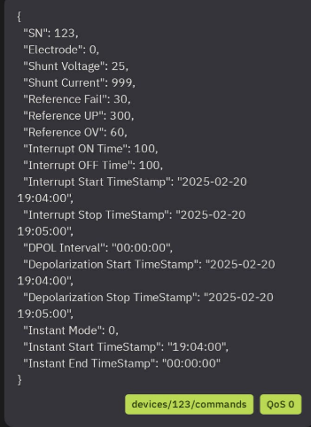

# Device Acknowledgment System Documentation

## Overview

The Device Acknowledgment System is a lightweight, memory-based solution for ensuring reliable communication between the IoT platform and connected devices. It provides guaranteed delivery confirmation, timeout handling, retry mechanisms, and real-time status tracking for all device configuration commands without requiring database storage.

## Architecture

### System Components

1. **Backend Services**
   - Memory-based Command Tracking
   - Enhanced MQTT Service
   - DeviceAcknowledgment Controller
   - Enhanced Device Controller
   - Socket.IO Real-time Service

2. **Frontend Components**
   - DeviceAcknowledgmentService (TypeScript)
   - DeviceAcknowledgmentMonitor (Vue Component)
   - Device Configuration Forms (Enhanced)

3. **Communication Protocols**
   - MQTT (Device Communication) - Simplified to 2 topics
   - Socket.IO (Real-time Web Updates)
   - REST API (Client-Server Communication)

## Simplified MQTT Topics

The system uses only **2 MQTT topics** for all communication:

### 1. Commands Topic: `devices/123/commands`
- **Purpose**: Bidirectional communication
- **Outgoing**: Server sends commands to device
- **Incoming**: Device sends acknowledgments back

### 2. Data Topic: `devices/123/data`
- **Purpose**: Device telemetry data
- **Incoming**: Device sends sensor data and status updates

## How It Works

### 1. Command Initiation Flow

```
Frontend → API Request → Device Controller → MQTT Service → Device
                                                ↓
                                    Memory-based Command Record
                                                ↓
                                    Socket.IO Notification → Frontend
```

**Step-by-Step Process:**

1. **User Action**: User initiates device configuration from frontend
2. **API Call**: Frontend sends POST request to device configuration endpoint
3. **Authentication**: Middleware validates user permissions
4. **Controller Processing**: Device controller validates request and calls MQTT service
5. **Command Generation**: MQTT service generates unique UUID for command tracking
6. **Memory Storage**: Command record stored in memory with PENDING status
7. **MQTT Publish**: Command sent to device via `devices/123/commands` topic
8. **Timeout Setup**: Automatic timeout handler scheduled (default: 30 seconds)
9. **Real-time Notification**: Socket.IO event sent to frontend with command status
10. **Response**: API returns command details including commandId for tracking

### 2. Device Response Flow

```
Device → devices/123/commands → MQTT Service → Memory Update → Socket.IO → Frontend
```

**Step-by-Step Process:**

1. **Device Processing**: Device receives and processes configuration command
2. **ACK Generation**: Device sends acknowledgment to `devices/123/commands` topic
3. **MQTT Reception**: MQTT service receives acknowledgment message
4. **Command Matching**: System matches ACK to pending command using commandId
5. **Status Update**: Memory-based command record updated (SUCCESS/FAILED)
6. **Response Time Calculation**: Time difference between sent and acknowledged
7. **Timeout Cancellation**: Scheduled timeout handler cancelled
8. **History Update**: Command moved from pending to history with size limit
9. **Real-time Notification**: Socket.IO event broadcasts status update
10. **Statistics Update**: Success rates and response time metrics updated in memory

### 3. Timeout Handling Flow

```
Timeout Timer → Timeout Handler → Memory Update → Socket.IO → Frontend
```

**Step-by-Step Process:**

1. **Timer Expiration**: Scheduled timeout timer expires (no ACK received)
2. **Status Check**: System verifies command is still in PENDING state
3. **Timeout Marking**: Command record marked as TIMEOUT in memory
4. **History Move**: Command moved from pending to history
5. **Cleanup**: Timeout handler and pending command references cleared
6. **Notification**: Socket.IO event notifies frontend of timeout
7. **Retry Availability**: Command becomes eligible for retry operation

## Data Models

### Memory-based Command Record

```javascript
{
  commandId: String (UUID),           // Unique command identifier
  deviceId: String,                   // Target device identifier
  originalCommand: String,            // Command type (Interrupt, Normal, etc.)
  commandPayload: Object,             // Original command data
  status: String,                     // PENDING, SUCCESS, FAILED, TIMEOUT
  sentAt: Date,                       // Command send timestamp
  acknowledgedAt: Date,               // ACK received timestamp (optional)
  deviceResponse: Object,             // Device response data (optional)
  responseTime: Number,               // Response time in milliseconds (optional)
  timeout: Number                     // Timeout duration (milliseconds)
}
```

### Status States

- **PENDING**: Command sent, waiting for acknowledgment
- **SUCCESS**: Device acknowledged command successfully
- **FAILED**: Device acknowledged command with error
- **TIMEOUT**: No acknowledgment received within timeout period

## MQTT Message Formats

### Command Message Format (Server → Device)
**Topic**: `devices/123/commands`
```json
{
  "Device ID": "123",
  "Message Type": "settings",
  "sender": "Server",
  "CommandId": "550e8400-e29b-41d4-a716-446655440000",
  "Parameters": {
    "Electrode": 0,
    "Shunt Voltage": 25,
    "Shunt Current": 999,
    "Reference Fail": 30,
    "Reference UP": 300,
    "Reference OV": 60,
    "Interrupt ON Time": 100,
    "Interrupt OFF Time": 100,
    "Interrupt Start TimeStamp": "2025-02-20 19:04:00",
    "Interrupt Stop TimeStamp": "2025-02-20 19:05:00",
    "DPOL Interval": "00:00:00",
    "Depolarization Start TimeStamp": "2025-02-20 19:04:00",
    "Depolarization Stop TimeStamp": "2025-02-20 19:05:00",
    "Instant Mode": 0,
    "Instant Start TimeStamp": "19:04:00",
    "Instant End TimeStamp": "00:00:00"
  }
}
```

### Acknowledgment Message Format (Device → Server)
**Topic**: `devices/123/commands`
```json
{
  "CommandId": "550e8400-e29b-41d4-a716-446655440000",
  "status": "SUCCESS",
  "message": "Configuration applied successfully",
  "response": {
    "appliedSettings": {
      "frequency": 1000,
      "duration": 5000,
      "mode": "continuous"
    },
    "deviceStatus": "operational"
  }
}
```

### Error Acknowledgment Format (Device → Server)
**Topic**: `devices/123/commands`
```json
{
  "CommandId": "550e8400-e29b-41d4-a716-446655440000",
  "status": "FAILED",
  "message": "Invalid frequency value",
  "error": {
    "code": "INVALID_FREQUENCY",
    "details": "Frequency must be between 1-10000 Hz"
  }
}
```

### Data Message Format (Device → Server)
**Topic**: `devices/123/data`
```json
{
  "deviceId": "123",
  "timestamp": "2024-10-25T10:30:00.000Z",
  "telemetry": {
    "temperature": 25.6,
    "humidity": 60.2,
    "voltage": 3.3,
    "status": "operational"
  }
}
```

## Memory Management

### Command Storage Strategy
- **Pending Commands**: Stored in Map for O(1) lookup by commandId
- **Command History**: Array with configurable size limit (default: 100 commands)
- **Automatic Cleanup**: Old commands automatically removed when history limit exceeded
- **Memory Efficiency**: No database overhead, fast in-memory operations

### Data Persistence
- **Temporary Storage**: Commands stored only during server runtime
- **Server Restart**: Command history lost on restart (by design for simplicity)
- **Real-time Focus**: System optimized for live command tracking, not historical analysis

## Performance Considerations

### Memory Optimization
- **Efficient Data Structures**: Maps for pending commands, Arrays for history
- **Size Limits**: Configurable limits prevent memory leaks
- **Automatic Cleanup**: Timeout handlers automatically cleaned up

### Scalability
- **Single Device Focus**: Optimized for device 123 (easily extendable)
- **Horizontal Scaling**: Multiple server instances supported with shared MQTT
- **Load Distribution**: MQTT and Socket.IO connections can be load balanced

## Error Handling

### Timeout Scenarios
1. **Network Issues**: Device offline or unreachable
2. **Device Malfunction**: Device not responding to commands
3. **Processing Delays**: Device taking longer than expected

### Retry Logic
- **Manual Retry Only**: Users can retry failed/timeout commands
- **No Automatic Retry**: Simplified approach without automatic retry complexity
- **Command Duplication**: Each retry creates new command with new UUID

### Error Recovery
1. **Immediate Retry**: For transient network issues
2. **Manual Intervention**: For persistent failures
3. **Real-time Alerts**: Socket.IO notifications for command failures

## Configuration

### Memory Limits
```javascript
{
  maxHistorySize: 100,              // Maximum commands in history
  defaultTimeout: 30000,            // Default command timeout (30 seconds)
  cleanupInterval: 60000             // Periodic cleanup interval
}
```

### MQTT Configuration
```javascript
{
  host: 'broker.zeptac.com',
  port: 1883,
  topics: {
    commands: 'devices/123/commands',    // Bidirectional command topic
    data: 'devices/123/data'             // Device telemetry data
  }
}
```

## Security Considerations

### Authentication
- **API Endpoints**: All acknowledgment endpoints require authentication
- **MQTT Security**: Device authentication at broker level
- **Command Validation**: Input validation for all configuration commands

### Data Protection
- **Memory-only Storage**: No persistent sensitive data storage
- **Encryption**: MQTT and API communications encrypted
- **Access Controls**: Permission-based command execution

## Monitoring and Analytics

### Key Metrics (Memory-based)
- **Success Rate**: Percentage of successfully acknowledged commands
- **Average Response Time**: Mean time for device acknowledgments (live calculation)
- **Timeout Rate**: Percentage of commands that timeout
- **Current Status**: Real-time pending command count

### Real-time Dashboard Features
- **Live Command Status**: Current pending and recent commands
- **Response Time Tracking**: Live calculation of device response performance
- **Command History**: Limited historical view (last 100 commands)
- **Device Health**: Real-time device communication status

## API Endpoints

### Device Configuration Endpoints
```
POST /api/devices/:deviceId/config/interrupt
POST /api/devices/:deviceId/config/manual
POST /api/devices/:deviceId/config/normal
POST /api/devices/:deviceId/config/dpol
POST /api/devices/:deviceId/config/inst
POST /api/devices/:deviceId/config/settings
```

### Settings Configuration Example
```bash
# PowerShell/curl example
curl -X POST http://localhost:3000/api/devices/123/config/settings `
  -H "Content-Type: application/json" `
  -H "Authorization: Bearer YOUR_TOKEN" `
  -d '{
    "electrode": 0,
    "shuntVoltage": 25,
    "shuntCurrent": 999,
    "referenceFail": 30,
    "referenceUP": 300,
    "referenceOV": 60,
    "interruptOnTime": 100,
    "interruptOffTime": 100,
    "interruptStartTimestamp": "2025-02-20 19:04:00",
    "interruptStopTimestamp": "2025-02-20 19:05:00",
    "dpolInterval": "00:00:00",
    "depolarizationStartTimestamp": "2025-02-20 19:04:00",
    "depolarizationStopTimestamp": "2025-02-20 19:05:00",
    "instantMode": 0,
    "instantStartTimestamp": "19:04:00",
    "instantEndTimestamp": "00:00:00"
  }'
```

### Acknowledgment Management Endpoints (Memory-based)
```
GET  /api/device-acknowledgment/command/:commandId        # Get specific command status
GET  /api/device-acknowledgment/device/:deviceId          # Get device command history
GET  /api/device-acknowledgment/device/:deviceId/stats    # Get device statistics
GET  /api/device-acknowledgment/device/:deviceId/pending  # Get pending commands
POST /api/device-acknowledgment/command/:commandId/retry  # Retry failed command
GET  /api/device-acknowledgment/system/overview           # Get system overview
```

## Troubleshooting

### Common Issues

#### High Timeout Rate
- **Symptoms**: Many commands timing out
- **Causes**: Network issues, device offline, processing delays
- **Solutions**: Check device connectivity, verify MQTT broker status

#### Missing Acknowledgments
- **Symptoms**: Commands marked as PENDING indefinitely
- **Causes**: MQTT broker issues, device not sending ACK to correct topic
- **Solutions**: Verify device sends ACK to `devices/123/commands` with CommandId

#### Memory Usage Concerns
- **Symptoms**: Server memory usage growing
- **Causes**: History size too large, timeout handlers not cleaned up
- **Solutions**: Reduce maxHistorySize, check timeout cleanup logic

### Debugging Tools
- **Console Logs**: Detailed MQTT message logging
- **Memory Inspector**: Check pending commands and history size
- **Real-time Monitor**: Socket.IO events for live debugging

## Implementation Benefits

### Simplified Architecture
- **No Database Dependency**: Eliminates database setup and maintenance
- **Faster Operations**: In-memory operations much faster than database queries
- **Easier Deployment**: Reduced infrastructure requirements

### Real-time Focus
- **Live Monitoring**: Optimized for real-time command tracking
- **Immediate Feedback**: Instant status updates via Socket.IO
- **Low Latency**: Memory operations provide minimal latency

### Development Efficiency
- **Rapid Prototyping**: Quick setup without database schema management
- **Easy Testing**: Simple to test and debug memory-based operations
- **Flexible**: Easy to modify and extend for specific requirements

## Future Enhancements

### Planned Features
- **Multi-device Support**: Extend to support multiple devices
- **Persistent History**: Optional database storage for long-term history
- **Advanced Analytics**: Trend analysis and pattern recognition
- **Command Queuing**: Queue commands when device is offline

### Scalability Options
- **Redis Integration**: Use Redis for shared memory across server instances
- **Database Option**: Add optional database backend for persistence
- **Microservices**: Split acknowledgment system into separate service

## Best Practices

### Development
1. **Use Memory Limits**: Always configure appropriate history size limits
2. **Handle Timeouts**: Implement proper timeout handling in frontend
3. **Monitor Memory**: Track memory usage in production
4. **Real-time Updates**: Leverage Socket.IO for live status updates

### Operations
1. **Monitor Performance**: Track success rates and response times
2. **Regular Health Checks**: Verify MQTT connectivity and device status
3. **Memory Management**: Monitor server memory usage patterns
4. **Error Alerting**: Set up alerts for high failure rates

### Device Implementation
1. **Always ACK**: Device must send acknowledgment for every command
2. **Include CommandId**: ACK messages must include the original CommandId
3. **Use Correct Topic**: Send ACK to `devices/123/commands` topic
4. **Status Indication**: Clearly indicate SUCCESS or FAILED status

---

*Last Updated: October 25, 2024*
*Version: 2.0 - Simplified Memory-based Implementation*
*Author: IoT Platform Team*